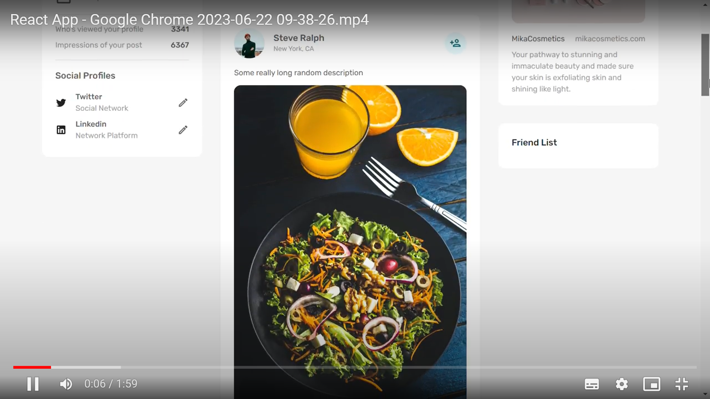

# 🌐 Sociopedia

Sociopedia is a Full Stack Responsive MERN (MongoDB, Express, React, Node) application built by Mohammad Zaatari 👨‍💻. The app includes the following features:

- 🔐 Authentication system to allow users to sign up, log in, and log out
- ❤️ Like system to allow users to like and unlike posts
- 🌑 Dark mode functionality
- 💻 Frontend built using React
- 📁 Backend built using MongoDB
- 💅 Design and styling using MUI (Material-UI)

## Skills Utilized

The following skills were utilized in the development of Sociopedia:

- `MongoDB` 🍃
- `Back-End Web Development` 🖥️
- `Node.js` 🟢
- `Front-End Development` 🎨
- `React.js` ⚛️

## 📹 Demo Video

To see a demo of Sociopedia in action, please click [here](https://drive.google.com/file/d/1BUtTKMyU-34V5jRzm5VMSOHatbWVMb9d/view?usp=drive_open&t=3s) 🎥.

## 📷 Screenshot

